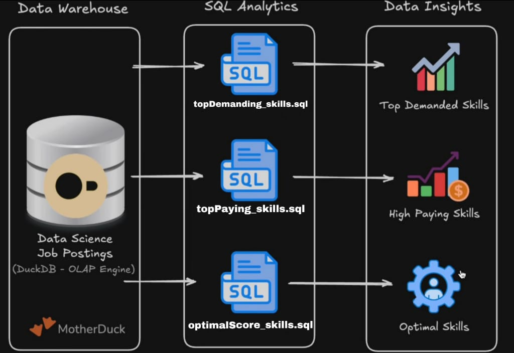
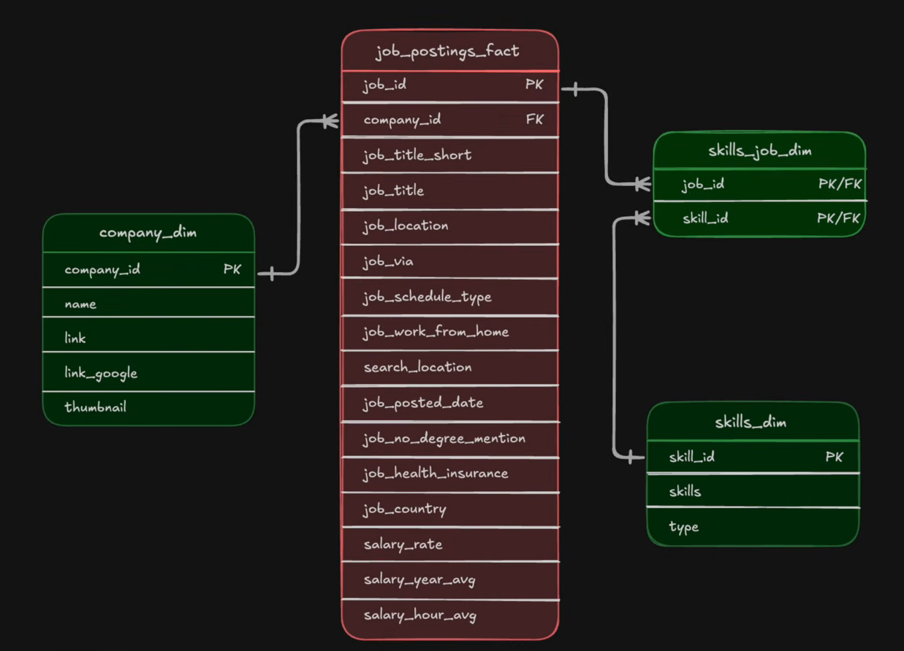

# 📊 Data Engineer Job Market — EDA Projects

My **first Exploratory Data Analysis (EDA) project**!

I used **SQL, DuckDB, MotherDuck, Python, Git Bash and VS Code** to explore the Data Engineer job market.

The main goal was simple:

> **What skills should a Data Engineer know, and how do those skills relate to job demand and salary?**





---

# 🔎 What is EDA?

**EDA = Exploratory Data Analysis**

Basically, EDA means:

> **Look at the data, ask questions, and find interesting things.**

Instead of building a machine learning model, I wanted to understand the job market using SQL.

I created **3 different analyses**:

1. 🔥 **Most In-Demand Skills**
2. 💰 **Highest-Paying Skills**
3. ⚡ **Optimal Skills** — combining demand + salary

---

# 🛠️ Tools I Used

- **SQL** — analyzing the data
- **DuckDB** — running SQL locally
- **MotherDuck** — working with DuckDB in the cloud
- **Python** — data analysis
- **Git Bash** — terminal
- **Git & GitHub** — version control
- **VS Code** — writing the code

---

# 🗂️ The Data

The project uses 3 tables:

### `job_postings_fact`

Contains the job postings.

Some important columns:

```text
job_id
job_title
job_work_from_home
salary_year_avg
```

### `skills_job_dim`

Connects jobs to their skills.

```text
job_id
skill_id
```

### `skills_dim`

Contains the actual skill names.

```text
skill_id
skills
```

---

# 🔗 How Did I Connect the 3 Tables?

This was one of the important SQL parts of the project.

I connected the tables using `job_id` and `skill_id`.

```sql
FROM 

    job_postings_fact AS jpf 

INNER JOIN skills_job_dim AS sjd

    ON sjd.job_id = jpf.job_id

INNER JOIN skills_dim AS sd

    ON sjd.skill_id = sd.skill_id
```

Basically:

```text
job_postings_fact
       │
       │ job_id
       ↓
skills_job_dim
       │
       │ skill_id
       ↓
skills_dim
```

So I can go from:

```text
Job
 ↓
Job's skill ID
 ↓
Actual skill name
```

This lets me answer questions like:

> "How many Data Engineer jobs require Python?"

and:

> "What is the median salary for jobs requiring Python?"

---

# 🎯 The 3 EDA Questions

## 1️⃣ What skills are most in demand?

I wanted to know:

> **Which skills appear the most in Data Engineer job postings?**

📄 [View SQL File →](C:\Random Files\SQL_Data_Engineering_Projects_27Hours\first_EDA\topDemanding_skills.sql)

---

## 2️⃣ What skills have the highest salaries?

I wanted to know:

> **Which skills are associated with the highest median salaries?**

📄 [View SQL File →](C:\Random Files\SQL_Data_Engineering_Projects_27Hours\first_EDA\topPaying_skills.sql)

---

## 3️⃣ What skills have the best combination of demand and salary?

I wanted to combine:

> **Demand + Salary**

to create my own `optimal_score`.

📄 [View SQL File →](C:\Random Files\SQL_Data_Engineering_Projects_27Hours\first_EDA\optimalScore_skills_salary)

---

# 🔥 EDA #1 — Most In-Demand Skills

📄 **[topDemanind_skills.sql](topDemanind_skills.sql)**

```sql
SELECT 
    sd.skills, 
    COUNT(jpf.*) AS demand_order
FROM 
    job_postings_fact AS jpf
INNER JOIN skills_job_dim AS sjd
    ON sjd.job_id = jpf.job_id
INNER JOIN skills_dim AS sd
    ON sjd.skill_id = sd.skill_id
WHERE 
    jpf.job_work_from_home = 'True' 
    AND jpf.job_title = 'Data Engineer'
GROUP BY 
    sd.skills
ORDER BY 
    demand_order DESC
LIMIT 10;
```

### What's happening here?

The important part is:

```sql
COUNT(jpf.*)
```

This counts how many job postings are associated with each skill.

Then:

```sql
ORDER BY demand_order DESC
```

puts the most demanded skills first.

And:

```sql
LIMIT 10
```

gives me the **top 10**.

### In simple words:

```text
Find Data Engineer jobs
        ↓
Find their skills
        ↓
Count each skill
        ↓
Sort from highest to lowest
        ↓
Show top 10
```

---

# 💰 EDA #2 — Highest-Paying Skills

📄 **[topPaying_skills.sql](topPaying_skills.sql)**

```sql
SELECT 
    sd.skills,
    COUNT(jpf.*) AS demand_order,
    ROUND(MEDIAN(jpf.salary_year_avg), 0) AS median_salary
FROM 
    job_postings_fact AS jpf
INNER JOIN skills_job_dim AS sjd 
    ON sjd.job_id = jpf.job_id
INNER JOIN skills_dim AS sd 
    ON sjd.skill_id = sd.skill_id
WHERE 
    jpf.job_work_from_home = 'True' 
    AND jpf.job_title = 'Data Engineer'
GROUP BY 
    sd.skills
HAVING 
    COUNT(jpf.*) > 100
ORDER BY 
    median_salary DESC
LIMIT 10;
```

### What's happening here?

This time, I'm interested in salary.

The important part is:

```sql
MEDIAN(jpf.salary_year_avg)
```

This calculates the **median yearly salary** for each skill.

I also added:

```sql
HAVING COUNT(jpf.*) > 100
```

So I only look at skills that appear in **more than 100 job postings**.

Then:

```sql
ORDER BY median_salary DESC
```

puts the highest-paying skills first.

### Why median?

Imagine these salaries:

```text
$50K
$55K
$60K
$65K
$200K
```

The $200K salary can pull the average up.

The median is:

```text
$60K
```

So median can give us a better idea of the typical salary when there are extreme values.

---

# ⚡ EDA #3 — Optimal Skills

📄 **[optimalScore_skills_salary.sql](optimalScore_skills_salary.sql)**

```sql
SELECT 
    sd.skills, 
    LN(COUNT(jpf.*)) AS demand_order,
    ROUND(MEDIAN(jpf.salary_year_avg), 0) AS median_salary,
    ROUND(
        MEDIAN(jpf.salary_year_avg) 
        * LN(COUNT(jpf.*)) 
        / 1000000, 
        2
    ) AS optimal_score
FROM 
    job_postings_fact AS jpf
INNER JOIN skills_job_dim AS sjd
    ON sjd.job_id = jpf.job_id
INNER JOIN skills_dim AS sd
    ON sjd.skill_id = sd.skill_id
WHERE 
    jpf.job_work_from_home = 'True' 
    AND jpf.job_title = 'Data Engineer' 
    AND jpf.salary_year_avg IS NOT NULL 
GROUP BY 
    sd.skills 
HAVING 
    COUNT(jpf.*) > 100
ORDER BY 
    optimal_score DESC
LIMIT 25;
```

### What's different here?

This one combines **demand and salary**.

I created:

```sql
optimal_score
```

using:

```text
Median Salary × LN(Demand)
--------------------------
        1,000,000
```

The idea is simple:

> A skill that appears frequently AND is associated with higher salaries gets a higher score.

---

# 🧠 Why `LN()`?

Instead of using the raw demand:

```sql
COUNT(jpf.*)
```

I used:

```sql
LN(COUNT(jpf.*))
```

The logarithm reduces the huge difference between very common and less common skills.

For example, going from:

```text
100 → 200 jobs
```

should matter, but going from:

```text
10,000 → 10,100 jobs
```

should not completely dominate the calculation.

---

# 📊 The Difference Between The 3

| Analysis | What am I looking for? | Main Calculation |
|---|---|---|
| 🔥 Top Demand | Most requested skills | `COUNT()` |
| 💰 Top Paying | Highest-paying skills | `MEDIAN()` |
| ⚡ Optimal Skills | Demand + Salary | `MEDIAN() × LN(COUNT())` |

---

# 🔍 What Stays The Same?

All 3 queries focus on:

### Remote jobs

```sql
jpf.job_work_from_home = 'True'
```

### Data Engineer jobs

```sql
jpf.job_title = 'Data Engineer'
```

### Grouping by skill

```sql
GROUP BY sd.skills
```

This means I'm calculating the results **for each individual skill**.

---

# 🧩 WHERE vs HAVING

One thing I learned from this project is the difference between `WHERE` and `HAVING`.

### `WHERE`

Filters the data **before grouping**.

For example:

```sql
WHERE 
    jpf.job_work_from_home = 'True'
    AND jpf.job_title = 'Data Engineer'
```

This tells SQL:

> Only look at remote Data Engineer jobs.

---

### `HAVING`

Filters the groups **after grouping**.

For example:

```sql
HAVING COUNT(jpf.*) > 100
```

This tells SQL:

> After grouping by skill, only keep skills that appear more than 100 times.

---

# 📁 Project Files

Here are the three main SQL files:

### 🔥 Most In-Demand Skills

[**topDemanind_skills.sql**](topDemanind_skills.sql)

Finds the 10 most frequently requested skills.

### 💰 Highest-Paying Skills

[**topPaying_skills.sql**](topPaying_skills.sql)

Finds the 10 skills with the highest median salaries.

### ⚡ Optimal Skills

[**optimalScore_skills_salary.sql**](optimalScore_skills_salary.sql)

Combines skill demand and salary into a custom `optimal_score`.

---

# 📚 SQL Concepts I Practiced

During this project I practiced:

- `SELECT`
- `FROM`
- `INNER JOIN`
- `ON`
- `WHERE`
- `GROUP BY`
- `HAVING`
- `COUNT()`
- `MEDIAN()`
- `ROUND()`
- `LN()`
- `ORDER BY`
- `DESC`
- `LIMIT`
- `AS`

---

# 🚀 My EDA Process

The project basically followed this process:

```text
Get the data
     ↓
Understand the tables
     ↓
Connect the tables
     ↓
Ask questions
     ↓
Write SQL
     ↓
Analyze the results
     ↓
Find patterns
     ↓
Learn from the data
```

---

# 🎓 What I Learned

This was my **first EDA project**, so the main goal was to learn how to actually work with data instead of just learning SQL syntax.

I learned how to:

- Connect multiple tables
- Filter data
- Group data
- Count values
- Calculate median salaries
- Compare demand and salary
- Create a custom metric
- Use DuckDB and MotherDuck
- Work with Git Bash
- Push a project to GitHub

Most importantly, I learned that **EDA is about asking questions and using the data to find the answers.**

---

# ⭐ Final Thought

This project is my first step into practical data analysis.

The questions were simple:

> **What skills are in demand?**

> **What skills pay more?**

> **What happens when I combine the two?**

And that's what this EDA is all about.